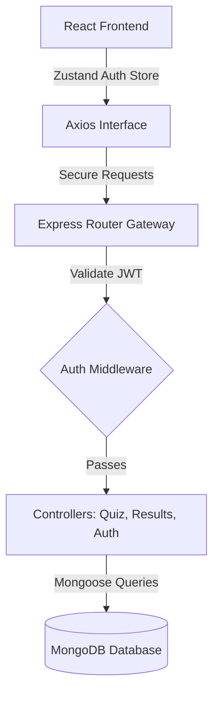

<div align="center">

# ⚡ MindSpark

### Full-Stack Interactive Trivia Platform · MERN Stack

[](https://react.dev)
[](https://nodejs.org)
[](https://expressjs.com)
[](https://mongodb.com)
[](https://github.com/pmndrs/zustand)

**MindSpark** is an interactive, full-stack quiz and learning platform built on the MERN stack. Features structured quiz creation tools, category filters, progress tracking, secure authentication, and global score logs.

*State Management via Zustand · Secure JWT Cookies · Live Scoreboards · Rate-Limited Endpoints*

</div>

---

## ✨ Key Features

| Feature | Description |
|---------|-------------|
| 📝 **Interactive Quiz Engine** | Dynamically serves multiple-choice questions with real-time timers and instant scoring. |
| 👤 **User Profiles & Scores** | Logs user history, tracks percentage scores, and displays dashboard stats. |
| 🛡️ **JWT Cookie Authentication** | Secure user registration and token authorization using HTTP-only cookies. |
| 🗄️ **Admin Control Panel** | Allows authenticated administrators to add, update, and manage quiz categories and questions. |
| 📈 **API Protection** | Implements route-level rate limiting and request validation middleware on the server. |

---

## 🧱 Tech Stack

| Layer | Technology |
|-------|-----------|
| ⚛️ **Frontend UI** | React (Vite) & CSS modules |
| ⚙️ **State Store** | Zustand |
| 🟢 **Backend Server** | Express (Node.js) |
| 💾 **Database** | MongoDB Atlas via Mongoose ODM |
| 🔑 **Security** | JWT, BcryptJS, Cookie Parser, Rate-Limiter |

---

## ⚙️ Getting Started

### Prerequisites
* **Node.js** v18+
* **MongoDB** connection URI

### Installation & Run

#### 1. Setup Backend Server
```bash
cd server
npm install
# Configure your .env file (PORT, MONGO_URI, JWT_SECRET)
npm start
```
Backend runs at → **http://localhost:5000**

#### 2. Setup Frontend Client
```bash
cd ../client
npm install
npm run dev
```
Client runs at → **http://localhost:5173**

---

## 🏗️ Architecture



---

## 🧑‍💻 Author

**Partha Gayen**

[](https://github.com/ParthaG23)
[](https://www.linkedin.com/in/partha-gayen)

---

## 📜 License

This project is licensed under the **MIT License**.
